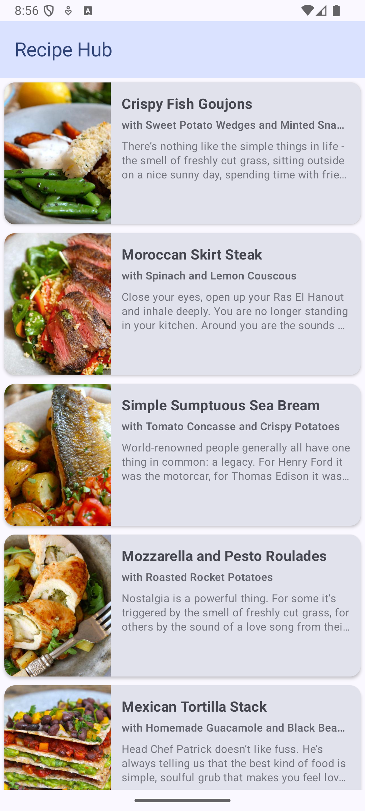
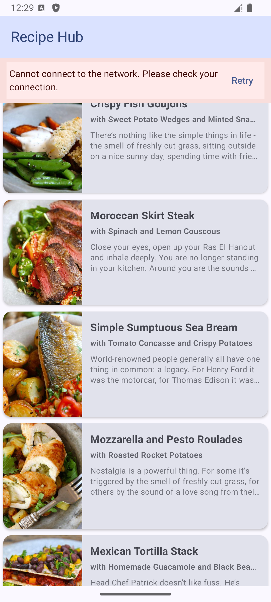
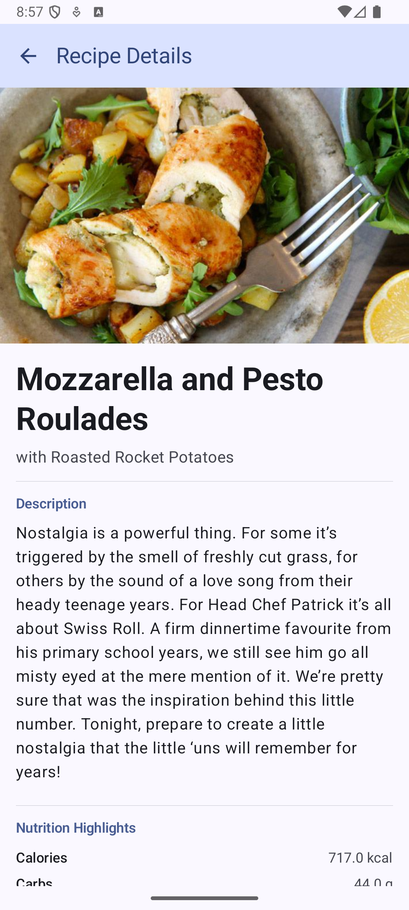

# Recipe App

A Recipe App that displays a list of recipes and allows users to view detailed information about any selected recipe with full offline support using local caching.

---

## Project Summary

This Recipe App follows a **clean architecture** with **MVVM** pattern, built using **Jetpack Compose** for the UI. The app is modularized into multiple layers and features for maintainability, scalability, and testability.

- **Offline Caching with Room Database**  
  Recipes are cached locally using **Room**. On initial launch, recipes are fetched from the API and saved locally.
  - If **online**, the app fetches fresh data from the API and updates the local cache.
  - If **offline**, the app retrieves recipes from the local Room database.
  - A **sticky header** notifies users when they are viewing **offline data**.
  - If no data is available in the local cache (first-time use or cache cleared), an **error banner** is shown.

---

## 📸 Screenshots

Here’s the main screen of the app:

## Architecture & Modules

- **Core Modules**:
    - `core-ui`: Common UI components and utilities.
    - `core-data`: Data sources and repositories.
    - `core-domain`: Business logic and use cases.
    - `core-network`: Networking and API-related code.

- **Feature Modules**:
  - `feature-recipehub:data`: Repositories, DTOs, Room Entities and data sources(Local & Remote) for RecipeHub.
  - `feature-recipehub:domain`: Use cases and domain models specific to RecipeHub.
  - `feature-recipehub:presentation`: UI screens and ViewModels using Jetpack Compose.

- **App Module**:
    - The main application module that combines feature modules and handles navigation.

---

## Technologies Used

- **Jetpack Compose** - Modern declarative UI toolkit for Android.
- **Jetpack Navigation Compose** - Navigation framework integrated with Compose.
- **Retrofit & Gson** - Network client and JSON parsing.
- **Room Database** – For local caching of recipes.
- **Coil** - Image loading library optimized for Compose.
- **Hilt** - Dependency Injection.
- **Kotlin Flow** - Reactive streams for state management and asynchronous data.
- **Repository Pattern** - To separate data sources and provide a clean API for the app.
- **JUnit** - Unit testing.
- **Espresso & Compose UI Test** - UI testing framework.

## Testing

- Unit tests are located in each module under `src/test`.
- UI tests are located in `androidTest` folders and utilize Espresso and Compose testing APIs.
- Run tests using:
  ./gradlew test
  ./gradlew connectedAndroidTest

## Project Structure
<pre> 
SampleApp/
├── app/ # Main application module (entry point)
├── feature/
│ └── recipehub/ # Feature module: RecipeHub
│ ├── data/ # Data layer: DTOs, repositories, data sources
│ ├── domain/ # Domain layer: Use cases, models
│ └── presentation/ # UI layer: ViewModels, Compose screens
├── core/
│ ├── ui/ # Shared Compose UI components (buttons, theming)
│ ├── data/ # Shared data utilities (e.g., mappers)
│ ├── domain/ # Shared domain contracts/interfaces
│ └── network/ # Retrofit setup, API configuration
└── README.md # Project documentation
</pre>
---

## Getting Started

### Prerequisites
- Android Studio Flamingo or newer
- Android Min SDK 24
- Android Max SDK 36
- Kotlin 2.0.21

